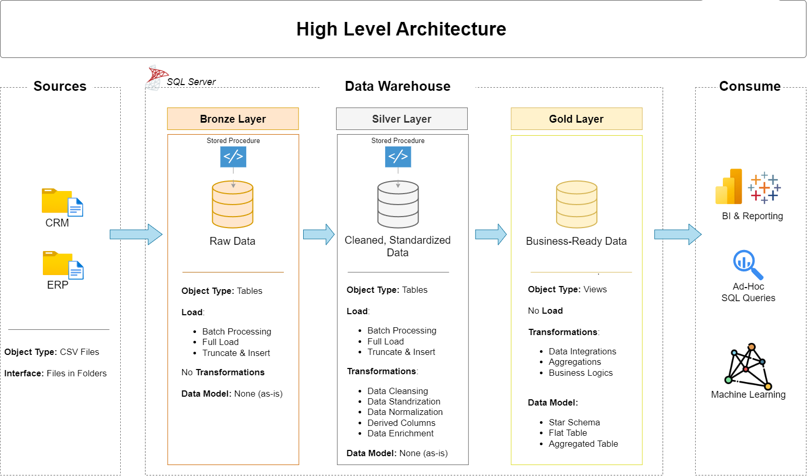

# SQL Data Warehouse Project 🚀

Welcome to the **Data Warehouse Project** repository!  
This project demonstrates a comprehensive data warehouse analytics solution, from building a data warehouse to generating actionable insights. Designed as a portfolio project, it highlights industry best practices in data engineering and analytics.

---

## 🚀 Project Requirements

### 🛠️ Building the Data Warehouse (Data Engineering)

**Objective:**

- **Data Sources**  
  Import data from two source systems (ERP and CRM) provided as CSV files.

- **Data Quality**  
  Cleanse and resolve data quality issues prior to analysis.

- **Integration**  
  Combine both sources into a single, user-friendly data model designed for analytical queries.

- **Scope**  
  Focus on the latest dataset only; historization of data is not required.

- **Documentation**  
  Provide clear documentation of the data model to support both business stakeholders and analytics teams.

---
## 🗂️ Data Architecture

Below is the high-level data architecture for this project, showing the data flow from the raw sources to the Bronze, Silver, and Gold layers:



---

## 📁 Project File Structure

```plaintext
data-warehouse-project/
│
├── datasets/                           # Raw datasets used for the project (ERP and CRM data)
│   ├── cust_info.csv
│   ├── prd_info.csv
│   ├── sales_details.csv
│   └── placeholder
│
├── docs/                               # Project documentation and architecture details
│   ├── data_architecture.png           # Architecture diagram for the README
│   ├── data_catalog.md                 # Catalog of datasets, including field descriptions and metadata
│   ├── data_integration.png            # Data integration diagram
│   ├── data_layers.pdf                 # PDF explaining data layering concepts
│   ├── naming_conventions.md           # Naming conventions for warehouse objects
│   └── placeholder
│
├── scripts/                            # SQL scripts for ETL and transformations
│   ├── Bronze layer/
│   │   ├── bronze_layer_tables_creation.sql
│   │   ├── bronze_layer_sql_procedure_for_bulk_insertion.sql
│   │   └── placeholder
│   │
│   ├── Silver layer/
│   │   ├── silver_layer_quality_checks.sql
│   │   └── placeholder
│   │
│   ├── Gold layer/
│   │   └── gold_layer_facts_dimensions_views.sql
│   │
│   ├── init_database.sql
│   └── placeholder
│
├── tests/                              # Test scripts and data quality checks
│   └── silver_layer_quality_checks.sql
│
├── README.md                           # Project overview and instructions
├── LICENSE                             # License information for the repository
├── .gitignore                          # Files and directories to be ignored by Git
└── requirements.txt                    # Dependencies and requirements for the project
## 🛡️ License

This project is licensed under the **MIT License**. You are free to use, modify, and share this project with proper attribution.


## 🌟 About Me

Hi there! I’m **Selalelo Moakamelo**, and I’m passionate about data engineering and building modern data solutions. I love exploring how data can drive meaningful insights, and I’m always excited to keep learning, growing, and sharing knowledge along the way.


Let's stay connected! Feel free to reach out and connect with me on these platforms.

  
- [LinkedIn](https://www.linkedin.com/in/selalelo-moakamelo-35b57719a)

---

*Thanks for exploring this project — happy data engineering!* 🚀


